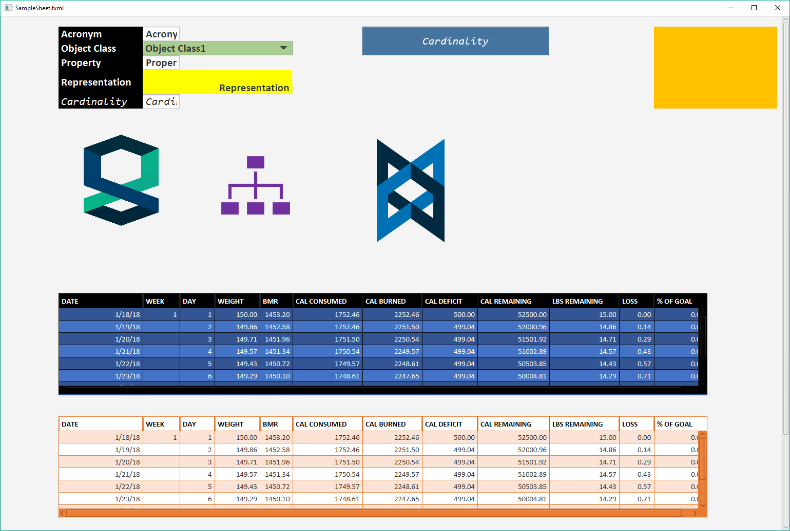
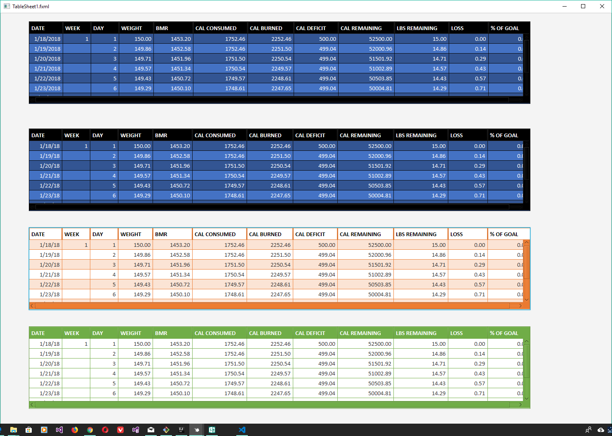
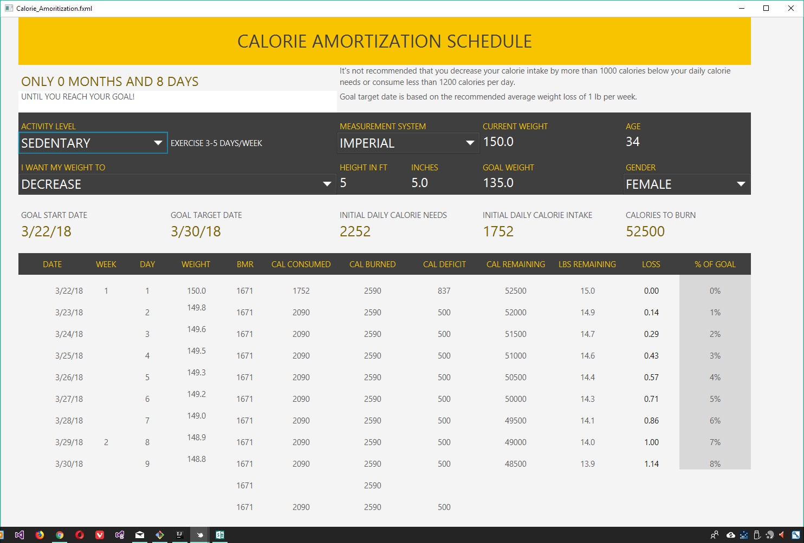

= Excel Spreadsheet to (Javafx, Html5, Xaml) UI Layout Generator

My main interest is in generating code artifacts(java,javascript,csharp) based on a model, and full stack code generation, Java being my main programming language.
So for this, I'm using excel as an UI prototyping tool and a custom version of link:https://www.unece.org/cefact/[UNCEFACT] CCTS to define the datamodel.

I've written a command line utility that generates UI layouts and controls, based on excel spreadsheets.
To illustrate the UI generation feature, below are sample spreadsheets and their outputs for html5 and javafx(screenshot).
I'm also working on generating models for binding the generated layouts to controls observable properties.
for (java, typescript/javascript and csharp).

This is still very much a work in progress

== link:input/sample.xlsx[sample.xlsx]
* Html5 link:html/javafx/html/SampleSheet.html[sample.xlsx - SampleSheet]
* Javafx fxml(screenshot)

== link:input/test-table.xlsx[test-table.xlsx]
* Html5 link:html/javafx/html/TableSheet1.html[test-table.xlsx - TableSheet1]
* Javafx fxml(screenshot)

== link:schedule1.xlsx[schedule1.xlsx]
* Html5 link:html/javafx/html/Calorie_Amortization.html[schedule1.xlsx - 'Calorie Amortization']
* Javafx fxml(screenshot)

== Some Useful Links

https://material.io/

https://getmdl.io/

http://www.patternfly.org/

https://www.w3schools.com/

https://metroui.org.ua/

http://www.oracle.com/webfolder/ux/middleware/alta/index.html

https://www.ibm.com/design/language/

https://developer.mozilla.org/en-US/

https://experience.sap.com/fiori-design/

https://tomassetti.me/antlr-mega-tutorial/#creating-a-grammar

http://www.antlr.org/

http://www.ecma-international.org/publications/standards/Ecma-376.htm

https://poi.apache.org/